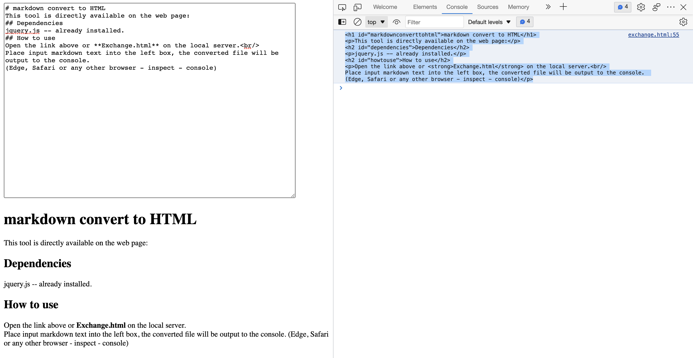

# markdown convert to HTML
This tool is directly available on the web page:
## Dependencies
jquery.js -- already installed.
## How to use
Open the link above or **Exchange.html** on the local server. 
Place input markdown text into the left box, the converted file will be output to the console. 
(Edge, Safari or any other browser - inspect - console)
